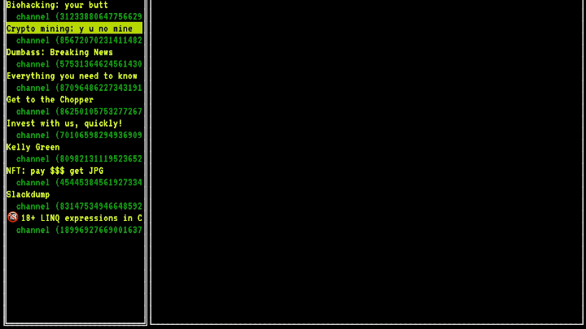

# Wipe My Chat
Delete all your messages in public and private chats.

---
> _In loving memory of V. Gorban, 1967-2022._
---

## Demo



## Usage

### GUI mode

1. Download the release from the [Releases page][1];
2. Unpack;
3. Run.

You will need:
- Telegram API ID
- Telegram API HASH

The program provides easy to follow instructions on how to get
those.

To authenticate, you will use your Telegram Account phone number and the code,
that will be sent to you in-app or a text message (SMS).

### Batch/Script mode

You can also run the deletion from script.  Follow these steps:

1. Get the list of chat IDs that you want to wipe:
   ```shell
   wipemychat -list
   ```
2. Use the chat IDs with `-wipe` flag:
   ```shell
   wipemychat -wipe 12345,56789
   ```

## Resetting login details

If you accidentally entered the wrong login details, or App Hash and App
Secret, you can reset them by running:

```
wipemychat -reset
```

This deletes both files with secrets, and you will be asked to authenticate
again.

## Licence
GNU Public Licence 3.0, see [LICENCE][2]

[1]: https://github.com/rusq/wipemychat/releases
[2]: LICENCE
